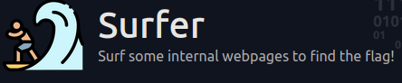
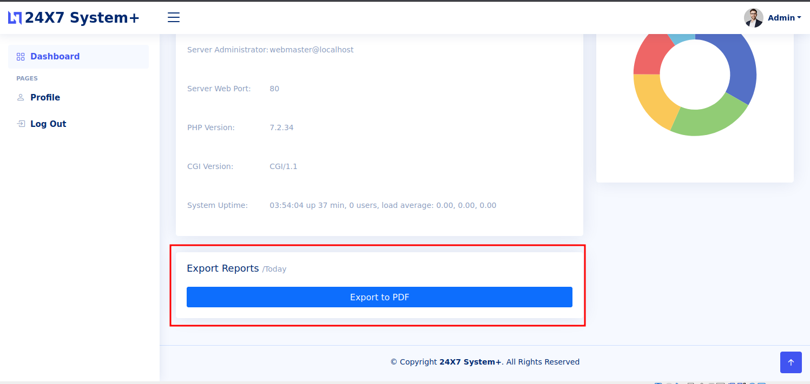
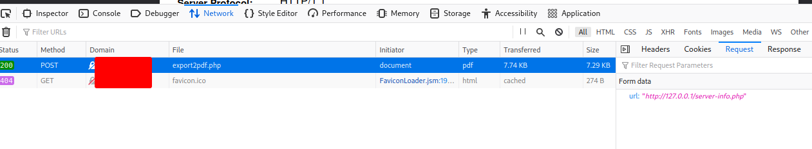
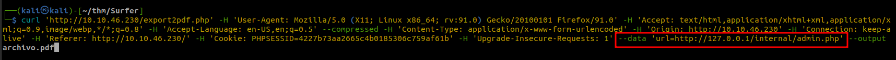
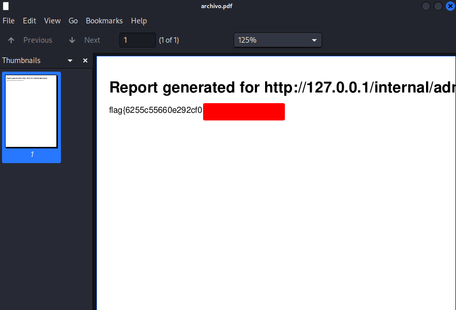

## Surfer CTF

  


### Enumeration

Buscamos Los puertos abiertos de la maquina

```bash
# Nmap 7.92 scan initiated Fri Oct 14 23:29:43 2022 as: nmap --min-rate=1000 -p- -n -v -sS -oN nmap.init surfer.thm
Nmap scan report for surfer.thm
Host is up (0.17s latency).
Not shown: 65533 closed tcp ports (reset)
PORT   STATE SERVICE
22/tcp open  ssh
80/tcp open  http

Read data files from: /usr/bin/../share/nmap
# Nmap done at Fri Oct 14 23:30:57 2022 -- 1 IP address (1 host up) scanned in 73.95 seconds
```

```bash
# Nmap 7.92 scan initiated Fri Oct 14 23:31:30 2022 as: nmap --min-rate=1000 -p22,80 -n -v -sCV -oN nmap.versions surfer.thm
Nmap scan report for surfer.thm
Host is up (0.17s latency).

PORT   STATE SERVICE VERSION
22/tcp open  ssh     OpenSSH 8.2p1 Ubuntu 4ubuntu0.4 (Ubuntu Linux; protocol 2.0)
| ssh-hostkey: 
|   3072 c6:62:fa:97:a4:35:01:7d:fd:a3:d3:91:26:da:0a:cd (RSA)
|   256 38:b4:b9:db:54:06:d5:bc:03:89:5f:9a:b8:71:2e:80 (ECDSA)
|_  256 f5:9f:48:a5:bc:8d:f5:c5:b4:03:9c:fd:77:a4:0b:77 (ED25519)
80/tcp open  http    Apache httpd 2.4.38 ((Debian))
| http-robots.txt: 1 disallowed entry 
|_/backup/chat.txt
|_http-favicon: Unknown favicon MD5: CFFCD51EFA49AB1AC1D8AC6E36462235
| http-methods: 
|_  Supported Methods: GET HEAD POST OPTIONS
| http-title: 24X7 System+
|_Requested resource was /login.php
|_http-server-header: Apache/2.4.38 (Debian)
| http-cookie-flags: 
|   /: 
|     PHPSESSID: 
|_      httponly flag not set
Service Info: OS: Linux; CPE: cpe:/o:linux:linux_kernel

Read data files from: /usr/bin/../share/nmap
Service detection performed. Please report any incorrect results at https://nmap.org/submit/ .
# Nmap done at Fri Oct 14 23:31:43 2022 -- 1 IP address (1 host up) scanned in 13.82 seconds
                                                                                                  
```

En el robots.txt estaba un chat interesante:

```
Admin: I have finished setting up the new export2pdf tool.
Kate: Thanks, we will require daily system reports in pdf format.
Admin: Yes, I am updated about that.
Kate: Have you finished adding the internal server.
Admin: Yes, it should be serving flag from now.
Kate: Also Don't forget to change the creds, plz stop using your username as password.
* Connection #0 to host surfer.thm left intact
Kate: Hello.. ?   
```

# Login en el panel de admin

admin:admin

Verificamos el generador de pdfs.

  

Revisando la request que se realizo.

  


Y haciendo una nueva request con la url que se encontro en el dashboard.

  


Obtenemos la FLAG.

  

