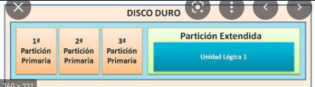

# Ejercicios de copias de seguridad linux

Ejercicios realizados para hacer copias de seguridad en linux.

- [Ejercicios de copias de seguridad linux](#ejercicios-de-copias-de-seguridad-linux)
  - [Ejercicios de Copias de seguridad](#ejercicios-de-copias-de-seguridad)
- [REPASO](#repaso)
    - [Repaso de permisos](#repaso-de-permisos)
    - [Sistemas de archivos](#sistemas-de-archivos)
      - [Particiones de sistemas operativos.](#particiones-de-sistemas-operativos)
      - [Razones para utilizar muchas particiones:](#razones-para-utilizar-muchas-particiones)
    - [Tipos de sistemas de archivos](#tipos-de-sistemas-de-archivos)
      - [NOTA](#nota)
    - [Gestores de arranque](#gestores-de-arranque)
- [Herramientas de particionado](#herramientas-de-particionado)
    - [Fdisk](#fdisk)
    - [parted](#parted)
    - [mkfs](#mkfs)
    - [dumpe2fs](#dumpe2fs)
    - [tune2fs](#tune2fs)
    - [debugfs](#debugfs)
    - [fsck](#fsck)
  - [Montaje de sistemas de archivos](#montaje-de-sistemas-de-archivos)
    - [Mount](#mount)
    - [Montaje con opciones](#montaje-con-opciones)
    - [Archivos interesantes para montaje](#archivos-interesantes-para-montaje)
  - [Cifrado sistemas de archivos](#cifrado-sistemas-de-archivos)
  - [Respaldando datos](#respaldando-datos)
    - [¿Cuales datos se van a respaldar?](#cuales-datos-se-van-a-respaldar)
      - [Caracteristicas de directorios linux](#caracteristicas-de-directorios-linux)

## Ejercicios de Copias de seguridad 

Estrategia de copias de seguridad o politica de copias de seguridad.

Consiste en:

* Acciones relacionadas con como se realizan las copias de seguridad
* Cual es la informacin a duplicar
* El tiempo
* El tipo de copia a realizar.

# REPASO

Contiene los comandos basicos para comprender como hacer respaldos de forma efectiva.

### Repaso de permisos 

Permisos simbolicos linux ER:

    `((u|g|o|a)(+|-|=)(r|w|x),*){1,n}`

setfacl hace una lista de control de acceso en los directorios.

Ejemplo uso.

Suponga que tenemos la cuenta de gimli y **gimli** necesita darle permisos a **legolas** sobre un archivo.

`gimli@onecoursesource:~$ getfacl setfacl -m user:dane:r-- sales_report`

`gimli@onecoursesource:~$ getfacl setfacl -m (USUARIO|GRUPO|OTHERS|MASK):USUARIO:PERMISOS ARCHIVO`

SELinux

Es un gestor para las politicas de linux.

### Sistemas de archivos

Hay varios sistemas de archivos 

* Fisicos 
  * DIspositivos, RAID, volumenes logicos, etc....
* Virtuales 
  * Son los que se muestran al usuario individual.

#### Particiones de sistemas operativos.

Hay varias razones para instalar **diferentes particiones** en los sistemas operativos.
Una de ellas es por que algunas particiones se encuentran mas optimizadas para realizar ciertas operaciones.

#### Razones para utilizar muchas particiones:

1. Opciones de montaje 
2. Diferentes tipos de sistemas de archivos
   1. Mejoras en seguridad
   2. Mejoramiento en procesamiento de archivos grandes 
3. Cuotas de disco (**Disk quotas**)
   1. Es la cantidad de espacio que un usuario puede usar en el sistema
4. Estrategias de copias de seguridad
   1. Si se tiene como estrategia hacer un respaldo diario de **/var/log** (Cambian constantemente los logs)
   2. Realizar un respaldo mensualmente de la carpeta **/boot** (Rara vez cambian)
5. Limitar el numero de sistemas de archivos llenos 
   1. Es posible que un usuario llene el directorio **/home/usuario** de información si se encuentra el SO en la misma partición puede **inutilizar** el sistema.
   2. Es una razon por la que las carpetas **/var,/tmp,/home** se montan en diferentes particiones por que los usuarios convencionales pueden crear archivos dentro de estas carpetas.

### Tipos de sistemas de archivos

| Sistema de archivos      | Caracteristicas |
| :---        |    :---  |
| XFS      | SIstema de archivos con registro de bitacora. Soporta sistemas de archivo arriba de 8 hexabytes      |
| eCryptfs (Enterprise Cryptographic File System) | Realiza el cifrado de los archivos almacenados dentro del sistema        |
| btrfs (B-tree FS)| Se enfoca en la tolerancia a fallos, facil administración. Contiene copias de seguridad **incrementales**, desfragmentacion sin desmontar  |

#### NOTA
* No todas las distribuciones soportan todos los sistemas de archivos

### Gestores de arranque 
Hay dos MBR que soporta solo 4 particones y GPT 

# Herramientas de particionado

### Fdisk 

* Genera el gestor de arranque del disco
  * MBR o GPT
* Manupula las tablas de particiones de discos
* Especifica como primarias y logicas las particiones de los mismos

    

`fdisk -l /dev/sdb`

### parted

* Particiona
* Genera sistemas de archivos en los discos 

`parted -l /dev/sda`

### mkfs 

* Crea sistemas de archivos de los discos
* Puede hacer varios tipos de sistemas de archivos 
* NOTA
  * Si no se expecifica la **bandera -m** en sistemas EXT se reservara el 5% de la particion al usuario **root**

`mkfs -t ext4 -m 10 /dev/sdb1`

### dumpe2fs

* Informacion detallada de sistemas de archivos **EXT**

### tune2fs

* Puede cambiar parametros **EXT**

### debugfs
 
* debug para sistemas de archivos **ext**

### fsck

* Repara sistemas de archivos corruptos (No se desmontaron correctamente)
* NO SE DEBE EJECUTAR LA UTILIDAD SISTEMAS DE ARCHIVOS YA MONTADOS

## Montaje de sistemas de archivos 

### Mount 
Es el comando para hacer el montaje del filesystem.
El comando sin argumentos tiene la siguiente estructura

**Dispocitivo** on **/URL_de_montaje** type **Tipo_sistema_archivos** (**Opciones**)

### Montaje con opciones 

`mount -o remount,ro /dev/dispocitivo`

### Archivos interesantes para montaje 

**/etc/mtab** Contiene información de las monturas, .

**/proc/mount** Archivo manejado por el kernel.

**/etc/fstab** Montaje de archivos automatico.

Hacer un UUID de una montura.

`
e2label /dev/sda2
blkid | grep sda2
`
Muestra el UUDI

## Cifrado sistemas de archivos 

## Respaldando datos

### ¿Cuales datos se van a respaldar?

Se sugiere usar multiples particiones o valumenes logicos ya que nos puede ayudar a hacer mejores estrategias de backup.
Por ejemplo utilizar una particion para almacenar el directorio **/home** en un **Logical Volume Manager (LVM)** y tomar una snapshot de tipo frozen. Esto ayudara que los usuarios sigan usando la partición mientras se esta haciendo un backup.

#### Caracteristicas de directorios linux

| Directorio      | Consideraciones |
| ----------- | ----------- |
| /home | Solo si tiene usuarios regulares hacer backup |
| /usr | Contiene comandos, doc y programas.   Solo hay cambios cuando se instala in software.  Hacer una lista de software instalado.   No es comun que se respalde   Si se va a hacer respaldo de este directorio tambien deberia hacerse de **/usr,/bin,/sbin,/lib,/lib64**|
|/bin| Lo mismo que **/usr**   Si se va a hacer respaldo de este directorio tambien deberia hacerse de **/usr,/bin,/sbin,/lib,/lib64** |
| /sbin |   Si se va a hacer respaldo de este directorio tambien deberia hacerse de **/usr,/bin,/sbin,/lib,/lib64** |
|/opt| Contiene software de terceras partes |
|/var| Contiene logs y emails |
|/boot| Contiene le kernel y archivos de boot.  |
|/lib y /lib64 |   Si se va a hacer respaldo de este directorio tambien deberia hacerse de **/usr,/bin,/sbin,/lib,/lib64**  |
|/etc| Contiene configuración del software |

